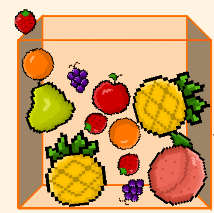

# 수박게임(unity.ver)

## 1. 프로젝트 개요
### 1-1. 프로젝트 정의
유니티 엔진을 이용한 2D 퍼즐게임이다. 같은 과일을 합쳐 상위 과일을 만들고 점수를 올려가는 방식의 게임이다. 좁은 공간에서 큰과일들이 밖으로 나가지 않고 더 높은 점수를 내는 방식이다.

### 1.2 주요 특징
- ``데이터 중심 설계`` : 스크립터블 오브젝트를 통한 유연한 데이터 관리
- ``최적화된 퍼포먼스`` : 오브젝트 풀링을 이용한 메모리 효율 상승
- ``현대적 입력 방식`` : Input System을 활용한 이벤트 기반 제어
- ``효과`` : 파티클 시스템과 오디오를 통해 과일 합성의 쾌감 구현

## 2. 핵심 기술 구현
### 2.1 Input System 
기존의 GetKey로 입력을 받는 것이 아닌 InputSystem을 이용하였다.
- ``추상화`` : 입력을 하드코딩으로 받는것이 아닌 Input Action으로 받아 유지보수성을 상승시킴
- ``확장성`` : 게임 로직과 입력 로직을 따로 분리시켜 결합도를 낮춤

### 2.2 Object Pooling

이부분은 사실 오브젝트의 갯수가 많다 적다는 상대적이기에 이번에는 배운것들 중에 최대한 활용하기위해서 사용하였다.
- ``메모리 관리`` : 위처럼 과일이 많아보이기도 하여서 배운 것을 활용하는 차원에서 사용하였다.

### 2.3 Scriptable Object
과일의 정보(id, name, 프리펩, 이미지 등)을 코드와 분리하여 Scriptable Object로 관리하였다.
- ``유연성`` : 코드 수정없이 인스펙터 창에서 과일들의 점수등 기획자분들이 밸런스를 조절할 수 있다.
- ``확장성`` : 새로운 과일을 추가할 때는 이미지와 프리펩 생성만으로도 즉시 대응이 가능하다.

## 3. 문제 해결
### 중복 합체 방지
- ``문제`` : 과일이 충돌하면 다음 과일로 변하는데 과일이 무한으로 생성되는 버그가 발생했다.
- ``원인`` : 과일의 ID값을 비교하여 변하게 했는데 과일이 각자가 변하게 만들어서 ID값이 같으면 각자가 변하는데 그렇게 되면 충돌하였을때 둘다 변하여 무한으로 합쳐지면서 무한으로 생성되는 원인이다.
- ``해결`` : 유니티에는 고유 메모리주소가 있다고 한다. **GetInstanceID()** 를 사용하여 같은 id값의 과일들이 합쳐지면 서로 다른점을 이용해 하나의 과일만 합쳐지도록 만들었다.
- ``결과`` : 한번에 충돌이 연쇄적으로 일어나도록 해봤지만 여러개의 과일들이 한번에 생성되지 않고 하나의 과일만 상위 과일로 변환되었다.